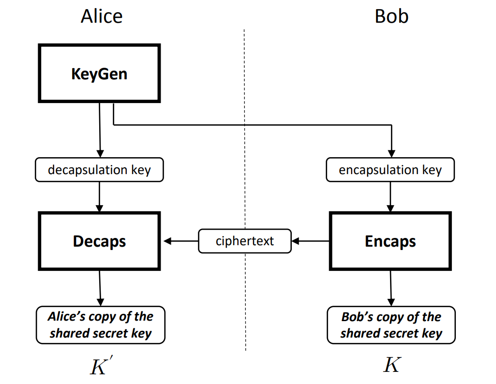
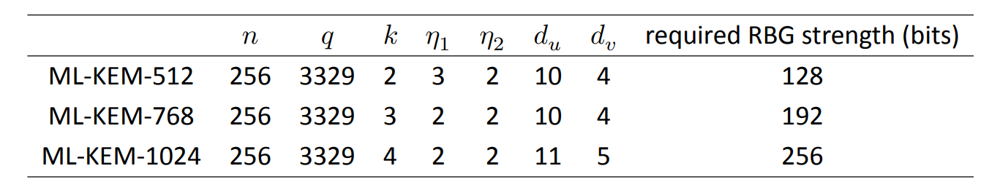
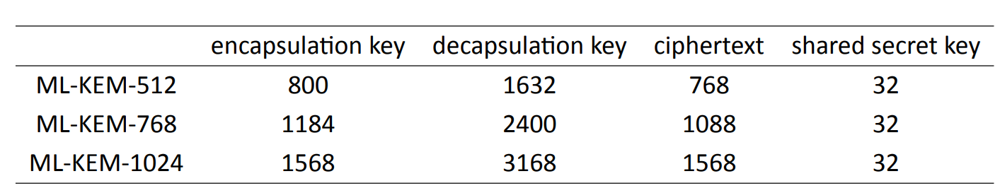

# Kyber: ML-KEM (FIPS-203)

This repository presents a short overview of **Kyber ML-PKE** algorithm as described in FIPS 203.


(FIPS 203) A simple view of key establishment using a KEM.

## Notation

- $n$: Degree of polynomials  
- $q$: Modulus  
- $k$: Security parameter  
- $\chi$: Noise distribution  
- $\mathcal{R}_q = \mathbb{Z}_q[X]/(X^n + 1)$  
- $d_u$, $d_v$: Compression bit-widths  
- $\texttt{G}$: Public matrix generation function from seed  
- $\texttt{KDF}$: Key derivation function (e.g., SHAKE256)  
- $\texttt{Hash}$: Hash function used for binding (e.g., SHA3-256)  
- $\texttt{Encode}$, $\texttt{Decode}$: Map bitstrings to/from polynomials  
- $\mu$: Shared random seed or message to be encapsulated  
- $\texttt{PRF}$: Pseudorandom function used in KEM for deterministic operations  


(FIPS 203) Approved parameter sets for ML-KEM.


(FIPS 203) Sizes (in bytes) of keys and ciphertexts of ML-KEM.

## 1. ML-KEM.KeyGen()

**Output**: Public key $\mathsf{pk} = (\rho, \mathbf{t})$, Secret key $\mathsf{sk} = (\mathbf{s}, \rho, \mathbf{t}, \texttt{hash(pk)})$

1. Generate random seed $\rho \in \{0,1\}^{256}$  
2. Compute matrix $\mathbf{A} = G(\rho)$  
3. Sample secret key $\mathbf{s} \leftarrow \chi^k$, error vector $\mathbf{e} \leftarrow \chi^k$  
4. Compute:
```math
   \mathbf{t} = \mathbf{A} \cdot \mathbf{s} + \mathbf{e} \mod q
```
5. Derive binding hash: $h = \texttt{Hash}(\rho \,\|\, \mathbf{t})$  
6. Output:
   - $\mathsf{pk} = (\rho, \mathbf{t})$  
   - $\mathsf{sk} = (\mathbf{s}, \rho, \mathbf{t}, h)$

## 2. ML-KEM.Encapsulate($\mathsf{pk}$)

**Input**: Public key $\mathsf{pk} = (\rho, \mathbf{t})$  
**Output**: Ciphertext $(\hat{\mathbf{u}}, \hat{\mathbf{v}})$, Shared key $K$

1. Sample random seed $\mu \leftarrow \{0,1\}^n$ (this becomes the shared secret seed)  
2. Derive ephemeral secret $\mathbf{r} \leftarrow \texttt{PRF}(\mu, \rho)$  
3. Derive message polynomial $m \leftarrow \texttt{Encode}(\mu)$  
4. Compute $\mathbf{A} = G(\rho)$  
5. Sample error vectors $\mathbf{e}_1 \leftarrow \chi^k$, $e_2 \leftarrow \chi$  
6. Compute:
```math
   \mathbf{u} = \mathbf{A}^T \cdot \mathbf{r} + \mathbf{e}_1 \mod q
```

```math
   \mathbf{v} = \mathbf{t}^T \cdot \mathbf{r} + e_2 + m \cdot \left\lfloor \frac{q}{2} \right\rfloor \mod q
```

7. Compress:
   - $\hat{\mathbf{u}} = \text{Compress}(\mathbf{u}, d_u)$  
   - $\hat{\mathbf{v}} = \text{Compress}(\mathbf{v}, d_v)$

8. Derive shared key:
```math
   K = \texttt{KDF}(\mu \,\|\, \texttt{Hash}(\hat{\mathbf{u}}, \hat{\mathbf{v}}))
```

9. Output ciphertext $(\hat{\mathbf{u}}, \hat{\mathbf{v}})$ and shared key $K$

## 3. ML-KEM.Decapsulate($`\mathsf{sk}, (\hat{\mathbf{u}}, \hat{\mathbf{v}})`$)

**Input**: Secret key $\mathsf{sk} = (\mathbf{s}, \rho, \mathbf{t}, h)$, Ciphertext $(\hat{\mathbf{u}}, \hat{\mathbf{v}})$  
**Output**: Shared key $K$

1. Decompress $\hat{\mathbf{u}}, \hat{\mathbf{v}}$ to obtain $\mathbf{u}, \mathbf{v}$  
2. Compute:
```math
   m' = \mathbf{v} - \mathbf{u}^T \cdot \mathbf{s} \mod q
```
3. Apply symmetric reduction and rounding:
   - $m'_i \gets \text{SymmetricMod}_q(m'_i)$  
   - $\mu_i = \text{Round}_q(m'_i)$  
   - $\mu = \texttt{Decode}(m')$

4. Recompute ephemeral $\mathbf{r} = \texttt{PRF}(\mu, \rho)$  
5. Recompute $\mathbf{A} = G(\rho)$  
6. Recompute:
```math
   \mathbf{u}' = \mathbf{A}^T \cdot \mathbf{r} + \mathbf{e}_1' \quad \text{(simulate)}
```
```math
   \mathbf{v}' = \mathbf{t}^T \cdot \mathbf{r} + e_2' + \texttt{Encode}(\mu) \cdot \left\lfloor \frac{q}{2} \right\rfloor
```
7. Compress $(\mathbf{u}', \mathbf{v}')$ and compare with $(\hat{\mathbf{u}}, \hat{\mathbf{v}})$:
   - If match: Accept $\mu$  
   - Else: Use fallback shared secret

8. Derive shared key:

```math
   K = \texttt{KDF}(\mu \,\|\, \texttt{Hash}(\hat{\mathbf{u}}, \hat{\mathbf{v}}))
```

9. Output: $K$

### ⚠️ Note on Decompression Accuracy

Decompression is inherently lossy: the original polynomial coefficients are quantized into fewer bits during compression, and exact reconstruction is not guaranteed after decompression.
However, Kyber’s parameters are chosen such that:

- The decompressed values are statistically close enough to the originals.
- The decryption and rounding operations are highly likely to still recover the correct message bits.
- The failure probability is negligible under chosen parameters (e.g., less than $2^{-100}$).

As a result, decryption succeeds with overwhelming probability in practice — even though it's not information-theoretically perfect.
