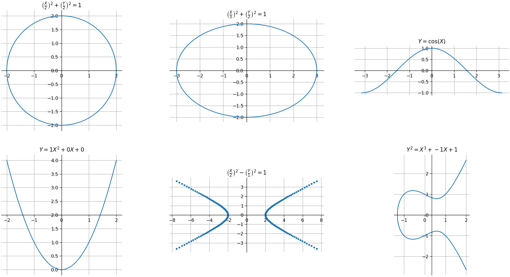
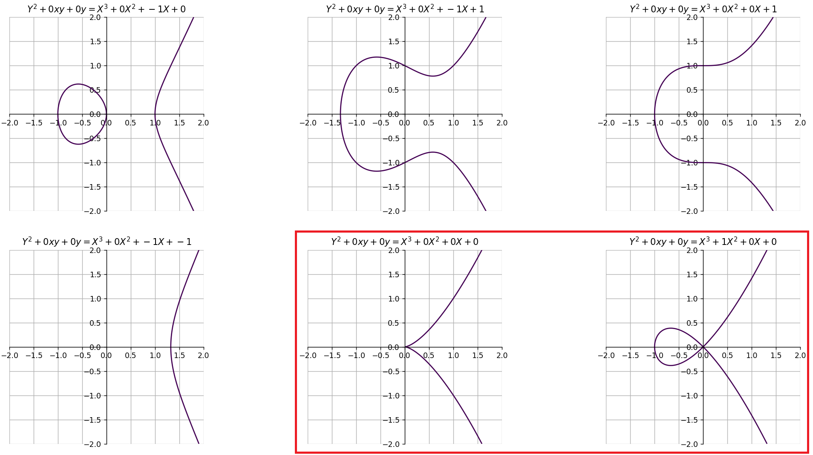

# [ECC (Elliptic Curve Cryptography)](https://csrc.nist.gov/projects/elliptic-curve-cryptography)  

Elliptic Curve Cryptography (ECC) is an asymmetric cryptographic scheme similar to RSA. The underlying mathematics rely on elliptic curves. Unlike traditional cryptographic systems that operate over integer fields, ECC performs calculations on points that lie on an elliptic curve in a Cartesian plane.  

# What Are Elliptic Curves?  

An elliptic curve is an abstract mathematical object generally defined as **"a smooth, projective, algebraic curve of genus one, with a specified point \( O \)."** This definition may seem complex, so let's break down the key terms:  

- **Smooth**: Basically this means a perspective of an object in a defined space.
- **Projective**: Basically, this refers to the perspective of an object in a defined space plus its extension to include points at infinity.  For example, the projective of the cartesian space is a space where every parallel line intersects at a sigle point at infinity.
- **Algebraic**: The curve consists of points that satisfy a polynomial equation.  
- **Genus** : We can see it as the number of holes when talking about surface (three dimension objects).
- **Specified point \( O \)**: This is point which belongs to the curve.

    

    <em>Fig 1: Smooth curves—curves without singularities— in the cartesian plan with they algebraic equation.</em>

This definition does not really give us a clear overview of what an elliptic curve could look like. Elliptic curves are generally presented by their algebraic equation, completed with the above criteria.

### Weirstrass curves

$$
y^{2} + a_{1}xy + a_{3}y = x^{3} + a_{2}x^{2} + a_{4}x + a_{6} \quad \text{(Weierstrass form)}
$$

$$
y^{2} = x^{3} + ax + b \quad \text{(Weierstrass reduced form)}
$$

where $a_i$ belongs to a field and the discriminant $\Delta$ (given by $4a^3 + 27b^2$ in the reduced form) is nonzero in $F_p$, defining an elliptic curve over $F_p$. Every elliptic curve over $F_p$ can be converted to a short Weierstrass equation if $p$ is larger than 3.

    

<em>Fig 2: Weierstrass curve representation. The surrounding curves are not elliptic as they have a singularity point (cusp and a double point), i.e., Δ = 0.</em>

### Montgomery curves

$$
By^2 = x^3 + Ax^2 + x \quad \text{(Montgomery form)}
$$

where $B(A^2 - 4)$ is nonzero in $F_p$, defining an elliptic curve over $F_p$. Substituting $x = Bu - A/3$ and $y = Bv$ produces the short Weierstrass equation:

$$
v^2 = u^3 + au + b
$$

where

$$
a = \frac{3 - A^2}{3B^2}, \quad b = \frac{2A^3 - 9A}{27B^3}.
$$

Montgomery curves were introduced by Montgomery in 1987.

### Edward curves

$$
y^{2} + x^{2} = 1 + dx^{2}y^{2} \quad \text{(Edwards form)}
$$

where $d(1 - d)$ is nonzero in $F_p$, defining an elliptic curve over $F_p$. Substituting $x = \frac{u}{v}$ and $y = \frac{u-1}{u+1}$ produces the Montgomery equation:

$$
Bv^2 = u^3 + Au^2 + u
$$

where

$$
A = \frac{2(1+d)}{1-d}, \quad B = \frac{4}{1-d}.
$$

Edwards curves were introduced by Edwards in 2007 in the case that $d$ is a fourth power. SafeCurves requires Edwards curves to be complete, i.e., for $d$ to not be a square; complete Edwards curves were introduced by Bernstein and Lange in 2007.
